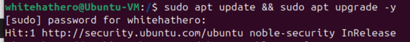
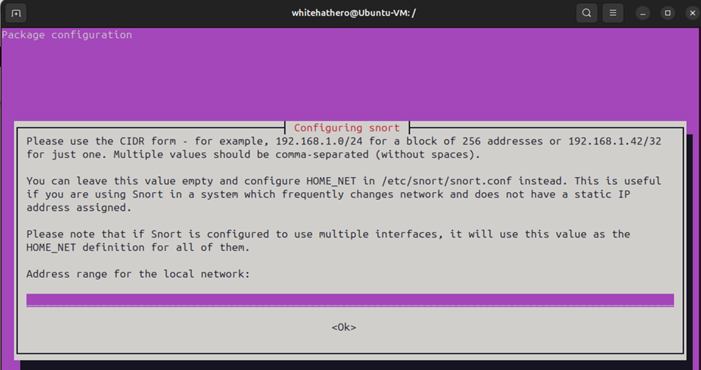
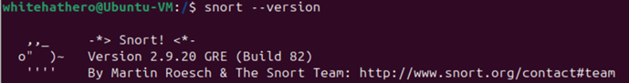
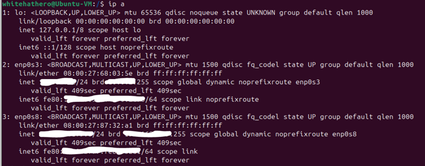
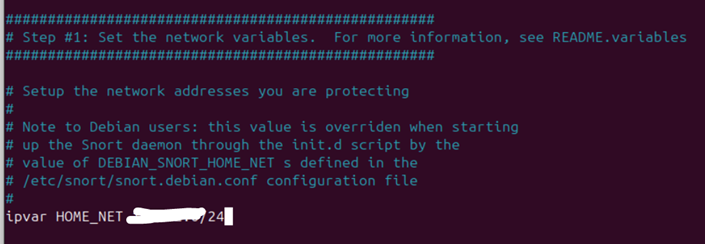
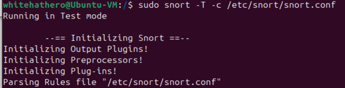
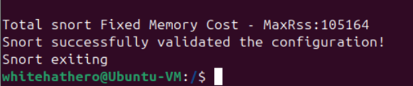
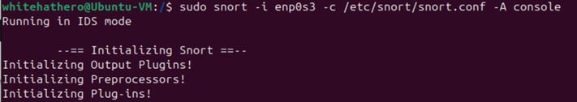

# Install-Snort-on-Ubuntu-VM-in-VirtualBox

## Objective
**`Snort`** is an open-source intrusion detection and prevention system (IDS/IPS). This guide provides step-by-step instructions for installing **`Snort`** on an **`Ubuntu virtual machine (VM)`** in **`VirtualBox`**. Whether you're setting up **`Snort`** for development, testing, or cybersecurity training, this walkthrough will ensure a smooth and successful installation process. By the end of this guide, you'll have **`Snort`** fully functional on an **`Ubuntu VM`** ready for use within **`VirtualBox`**. Let's get started!

## 1. Update and Upgrade the System
Before installing **`Snort`**, ensure your **`Ubuntu`** system is up to date.

**Command:** ***`sudo apt update && sudo apt upgrade -y`***

## 2. Install Snort

**Command:** ***`sudo apt-get install snort -y`***

While running the command, you’ll be presented with the following image. We’ll leave this blank for now.

## 3. Verify Snort Installation

**Command:** ***`snort --version`***

## 4. Find Your Network Interface

**Command:** ***`ip a`***

**Note:** If you’re using **`NAT`** for your home-lab environment between VMs **(including your Ubuntu VM on VirtualBox)**, your network interface is likely similar to **`enp0s3`**, and your IP address will be in the **`10.x.x.x/24`** range. However, this depends on how your **`VirtualBox`** network settings are set up. If you have a different interface name, use that instead of **`enp0s3`**.

### Network Modes & Their Impact:

Your IP address depends on your **`network settings`**:

**1.	NAT (Default Mode)**

✅ **IP:** **`10.x.x.x/24`**

✅ **Interface:** **`enp0s3`**

🔻 **Cannot sniff host network traffic (only VM's traffic).**

**2.	Bridged Adapter (Best for Snort IDS)**

✅ **IP:** **`Matches your physical network (e.g., 192.168.x.x/24)`**.

✅ **Can sniff traffic from other devices on your LAN.**

**3.	Host-Only Adapter**

✅ **IP:** **`192.168.56.x/24 (VirtualBox's internal network)`**.

🔻 **Only captures traffic between VMs.**

## 5. Edit Snort Configuration

**`Snort’s`** configuration file is located at: **`/etc/snort/snort.conf`**

Update the **`ipvar HOME_NET`** variable to match your home network/network interface’s IP address. In this exercise, it will be the **`enp0s3`** network interface IP address.

**Example:** 192.168.x.x/24 OR 10.x.x.x/24

**Command:** ***`sudo nano /etc/snort/snort.conf`***

Save & Exit.

## 6. Test Snort Configuration

Run **`Snort`** in **`test mode`** to check for errors.

**Command:** ***`sudo snort -T -c /etc/snort/snort.conf`***

If everything is correctly, you will see: **`“Snort successfully validated the configuration!”`**

## 7. Start Snort in Network Monitoring Mode

### Run Snort in IDS Mode:

**Command:** ***`sudo snort -i enp0s3 -c /etc/snort/snort.conf -A console`***

**`Note:`** If needed, replace **`enp0s3`** with your actual network interface.

**`Snort`** will now **`monitor traffic`** and display alerts on the console.

Congratulations! 🎉 You have successfully installed and configured **`Snort`** on your **`Ubuntu VM`**. Whether you're monitoring traffic, testing rules, or analyzing potential threats, **`Snort`** is a powerful tool to enhance your cybersecurity skills.

